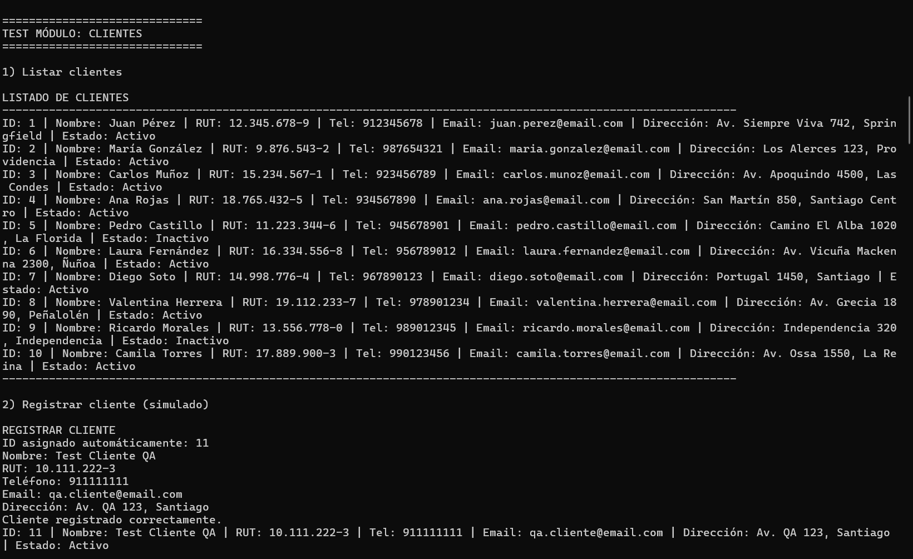
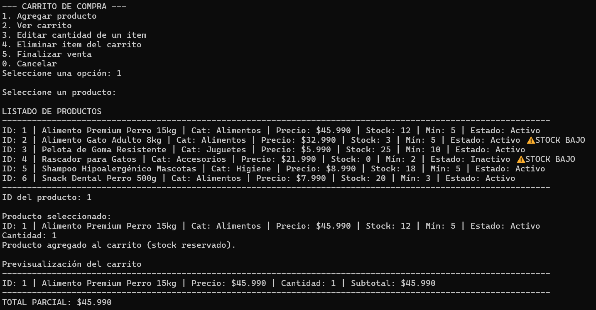
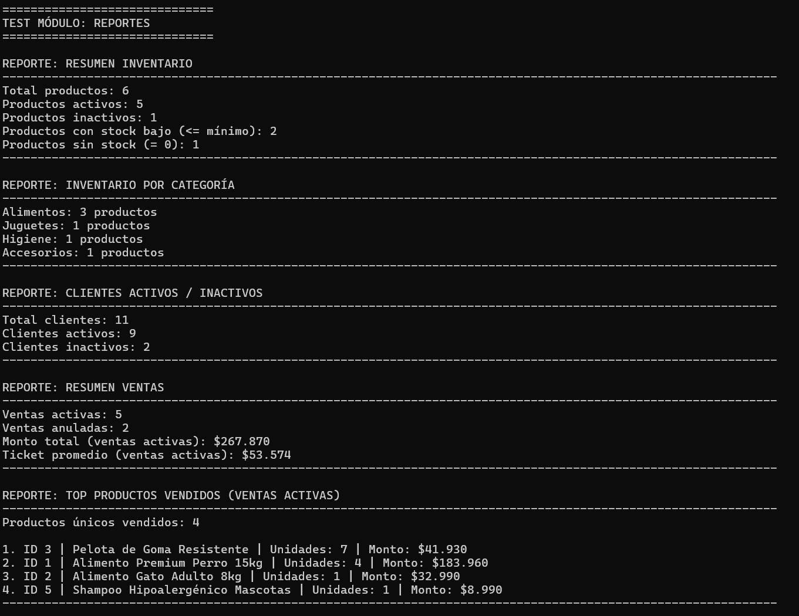

# 🧪 Informe de Validación  
**Sistema de Gestión de Datos – Python**  
ABP 2 | Módulo 3 – Desarrollo con Python

---

## 1. Introducción

El presente informe tiene como objetivo **documentar el proceso de validación del Sistema de Gestión de Datos**, desarrollado en Python como parte de la Actividad Basada en Proyectos (ABP 2) del Módulo 3.

La validación se realizó mediante **pruebas manuales controladas**, ejecutadas tanto desde el uso normal del sistema en consola como a través de un **script de pruebas automatizadas**, con el fin de verificar el correcto funcionamiento de todos los módulos y flujos críticos del sistema.

---

## 2. Objetivo de la Validación

Los objetivos principales del proceso de validación fueron:

- Verificar que todas las funcionalidades del sistema operan correctamente.
- Confirmar que el flujo de navegación entre menús es coherente y estable.
- Validar la correcta gestión de datos en inventario, clientes y ventas.
- Comprobar el control de stock durante el proceso de ventas.
- Validar la generación correcta de reportes.
- Asegurar que el sistema maneja adecuadamente entradas inválidas y errores comunes.

---

## 3. Metodología de Pruebas

La validación del sistema se realizó utilizando dos enfoques complementarios:

### 3.1 Pruebas Manuales desde Consola

Se ejecutó el sistema mediante el archivo principal `main.py`, navegando por los distintos módulos a través del menú principal, ingresando datos manualmente y observando el comportamiento del sistema en cada operación.

Este enfoque permitió validar la experiencia de usuario, la navegación entre menús y el correcto funcionamiento general del sistema.

---

### 3.2 Pruebas Manuales Automatizadas

Adicionalmente, se desarrolló un script de pruebas manuales automatizadas ubicado en: `tests/pruebas_manual.py`.

Este script ejecuta de forma secuencial pruebas sobre todos los módulos del sistema, simulando entradas del usuario y validando los principales flujos críticos, permitiendo una validación **repetible y controlada** del sistema completo.

Las pruebas automatizadas restauran el estado inicial de los datos al finalizar, evitando efectos secundarios entre ejecuciones.

---

## 4. Casos de Prueba Ejecutados

### 4.1 Módulo Inventario

Casos de prueba validados:

- Listado de productos existentes.
- Registro de nuevos productos.
- Actualización de stock.
- Activación y desactivación de productos.
- Validación de entradas inválidas.
- Visualización correcta del estado del producto.

📷 Evidencia:

---

### 4.2 Módulo Clientes

Casos de prueba validados:

- Listado de clientes.
- Registro de nuevos clientes.
- Modificación de datos de clientes existentes.
- Activación y desactivación de clientes.
- Validación de existencia y estado del cliente.

📷 Evidencia:

---

### 4.3 Módulo Ventas

Casos de prueba validados:

- Creación de una venta.
- Selección de cliente activo.
- Agregado de productos al carrito.
- Reserva de stock al agregar productos.
- Edición de cantidades en el carrito con ajuste de stock.
- Eliminación de productos del carrito con devolución de stock.
- Cancelación de venta con liberación total del stock reservado.
- Confirmación de venta con descuento definitivo de stock.
- Listado de ventas.
- Visualización del detalle de una venta.
- Anulación de venta con devolución de stock al inventario.

📷 Evidencia:

---

### 4.4 Módulo Reportes

Casos de prueba validados:

- Resumen general del inventario.
- Inventario agrupado por categoría.
- Resumen de ventas.
- Ranking de productos más vendidos.
- Ranking de clientes por monto de compras.
- Reporte de clientes activos e inactivos.

📷 Evidencia:

---

## 5. Resultados de la Validación

Tras la ejecución de todos los casos de prueba definidos, se concluye que:

- Todas las funcionalidades del sistema operan según lo esperado.
- No se detectaron errores críticos durante la ejecución de las pruebas.
- El control de stock durante el proceso de ventas funciona correctamente.
- Las validaciones de entrada previenen errores comunes del usuario.
- El sistema mantiene consistencia de datos incluso ante cancelaciones o anulaciones.
- Los reportes reflejan correctamente la información procesada por el sistema.

---

## 6. Observaciones

- El sistema presenta una navegación clara y controlada.
- Los mensajes mostrados al usuario son comprensibles y adecuados.
- La modularización facilita la validación individual de cada componente.
- El uso de pruebas manuales automatizadas mejora la confiabilidad del proceso de validación.

---

## 7. Conclusión

El proceso de validación realizado confirma que el **Sistema de Gestión de Datos** cumple con los requerimientos funcionales y técnicos definidos para la Actividad Basada en Proyectos del Módulo 3.

El sistema demuestra una correcta aplicación de los conceptos de programación en Python abordados durante el módulo, presentando una solución funcional, estable y bien estructurada.

---

## 8. Evidencia Adicional

Las capturas completas del proceso de validación, incluyendo pruebas adicionales y flujos detallados, se encuentran disponibles en el directorio: `docs/capturas/`.

---

